# Contributing to GitHub Well-Architected Framework

<!-- markdownlint-disable MD026 -->
<!-- markdownlint-disable MD036 -->

Welcome! 👋😄 We're excited to collaborate with you on the **GitHub Well-Architected Framework**. Please review these contribution guidelines before getting started. Contributions of all types are welcome!

By following these guidelines, you demonstrate respect for the time of the maintainers and community members managing this project. In return, they'll reciprocate that respect when addressing your contributions.

We want to make contributing as easy and transparent as possible, whether you're:

- Reporting an idea or bug
- Discussing the current state of the framework
- Submitting a fix or new feature
- Submitting content articles
- Asking the hard questions and being opinionated
- Becoming a maintainer

Thank you for contributing! We look forward to working with you. ❤️

---

**Table of Contents**

- [TLDR How we work together](#tldr-how-we-work-together)
- [Contribution workflow](#contribution-workflow)
  - [Step 1: Create GitHub Issue](#step-1-create-github-issue)
  - [Step 2: Fork & Author](#step-2-fork--author)
  - [Step 3: Build & Test](#step-3-build--test---verify-your-changes)
  - [Step 4: Raise Pull Request](#step-4-raise-pull-request)
  - [Step 5: Automated QA](#step-5-automated-qa---quality-validation)
  - [Step 6: Community Review](#step-6-community-review---collaborate-and-refine)
  - [Step 7: GitHub Review](#step-7-github-review---maintainer-approval)
  - [Step 8: Publish](#step-8-publish---go-live)
- [Types of contributions](#types-of-contributions)
  - [📝 Content Library Article Submission(s)]
  - [💻 Website Code Changes]
  - [🏠 General housekeeping contributions]
- [Contributor expectations](#contributor-expectations)
- [Code review guidelines](#code-review-guidelines)
- [Code of Conduct](#code-of-conduct)
- [License](#license)

---

## TL;DR How we work together

- :octocat: See [GitHub Well-Architected Framework overview] to understand the program and purpose.
- 🗳️ We use [GitHub Flow] to manage changes. It is the most effective way to collaborate with all stakeholders on this project.
- 🐙 [Issues] are used to **track work**, such as bug reports and feature requests. They are also used to keep track of ideas that may not yet be ready to work on.
- 🚢 [Pull requests] are the best way to collaborate on reviews.

---

## Contribution workflow

Here's how your contribution flows through from idea to publication:

```mermaid
flowchart LR
    A[Step 1<br />Create GitHub Issue] --> B[Step 2<br />Fork & Author]
    B --> C[Step 3<br />Build & Test]
    C --> D[Step 4<br />Raise Pull Request]
    D --> E[Step 5<br />Automated QA]
    E --> F[Step 6<br />Community Review]
    F --> H[[Step 7<br />GitHub Review]]
    H --> I[Step 8<br />Publish]

    style A fill:pink,color:#000
    style B fill:pink,color:#000
    style C fill:pink,color:#000
    style D fill:pink,color:#000
    style E fill:yellow,color:#000
    style F fill:pink,color:#000
    style H fill:silver,color:#000
    style I fill:yellow,color:#000
```



**Legend:**

- 🟪 Pink: Your actions as a contributor
- 🟨 Yellow: Automated processes
- ⬜ Silver: Maintainer review and approval

---

### Step 1: Create GitHub Issue

Start by creating an issue to propose your article idea. This helps us:

- Track contributions and avoid duplicate work
- Provide early feedback on your proposal
- Connect you with subject matter experts
- Ensure alignment with the framework's pillars

[Create a content request Issue] using our template, which will guide you through:

- Selecting the relevant pillar(s)
- Describing your proposed article
- Outlining the value it provides

> [!TIP]
> Browse existing [Issues] to see if someone else is already working on a similar topic. Collaboration is encouraged!

---

### Step 2: Fork & Author

Once you're ready to start, fork the repository and begin authoring. We **strongly recommend using GitHub Codespaces, a preconfigured IDE** for the best experience.

> [!IMPORTANT]
> Before creating a Codespace, verify your billing details. See [Codespaces pricing information].

#### Launch project in Codespaces

##### Option 1: Select

[](https://codespaces.new/github/github-well-architected-internal)

##### Option 2: From your fork

1. Click the green "Code" button and select "Create codespace on main"
2. Wait for the environment to initialize (automatically runs `tools/setup` to install dependencies and build the site)
3. Start writing!

##### Option 3: From the repository

1. Go to <https://github.com/codespaces>, click "New Codespace", select this repository, and choose the `main` branch
2. Select the default Dev container configuration: **Default project configuration**
3. Click "Create Codespace"

#### Create your article

There are three options to create a new article:

##### Option 1. Use the command `hugo new content` to create a new file (recommended in Codespaces)

```shell
# For recommendations:
hugo new content library/{PILLAR}/recommendations/{ARTICLE-NAME}.md
# For scenarios:
hugo new content library/scenarios/{ARTICLE-NAME}.md
```

For example,

```shell
hugo new content library/productivity/recommendations/my-article.md
```

> [!IMPORTANT]
> When you use this method, you do not need to put `content/` in the command since Hugo considers it the root.

##### Option 2. Use a page bundle to create a new article with associated files like images

Add a folder (instead of one markdown file) at that location and bundle the files together. The format is:

```plaintext
content/library/{PILLAR}/recommendations/{ARTICLE-NAME}/index.md
content/library/{PILLAR}/recommendations/{ARTICLE-NAME}/image1.png
content/library/{PILLAR}/recommendations/{ARTICLE-NAME}/image2.png
```

##### Option 3. Copy/paste the template into a new file

Simply copy [`archetypes/default.md`] and paste it into:

For **recommendation** articles:

```plaintext
content/library/{PILLAR}/recommendations/{ARTICLE-NAME}.md
```

For **scenario** articles:

```plaintext
content/library/scenarios/{ARTICLE-NAME}.md
```

##### Writing Style:

- Always use sentence case
- Keep your files tidy - no rogue spaces or characters, please
- Use dashes for unordered lists (not `*`)
- Use single spaces before and after headings, lists, and paragraphs

#### Edit front-matter

Each article (written in markdown) should have front-matter at the top of the file. This front-matter should look like this:

```yaml
---
draft: true # Set to false when ready to publish
title: 'Insert title here'
publishDate: 2024-12-05 # Date the article is published

# Add author details
params:
  authors:
    [
      { name: 'Mona', handle: 'octocat' },
    ]

# Classifications of the framework to drive key concepts, design principles, and architectural best practices
pillars:
  - placeholder
  - placeholder
---
```

- When you are done with your article, set `draft: false` when you are ready to publish.

- Set `publishDate` to the date the article is first merged to `main`. Do not change it on future revisions.

- All recommended values for all of these fields are described in [Taxonomies]. **Insert all that apply to your article. This is how your article will be discoverable!**

---

### Step 3: Build & Test - Verify your changes

Before submitting your pull request, test your article in the IDE to ensure everything looks correct.

#### Run test & lint

Run predefined tools in your Codespace terminal. To test,

```bash
tools/test
```

To lint markdown and YAML files,

```bash
tools/lint
```

#### Run the development server

In your Codespace terminal, run:

```bash
tools/server
```

The Codespace will automatically forward the port and display the URL where you can view the site. If you can't find it:

1. Click on the **Ports** tab in VS Code
2. Look for the forwarded address for port 1313
3. Click the globe icon to open it in your browser


The server watches for changes and automatically reloads as you edit files.

#### What to check

- [ ] Does your article render correctly?
- [ ] Are images and links working?
- [ ] Is the formatting clean and consistent?
- [ ] Does navigation work as expected?
- [ ] Run the test suite: `tools/test`

> [!TIP]
> Commit your changes frequently as you work. This helps you track progress and makes it easier to recover if something goes wrong.

---

### Step 4: Raise Pull Request

Once you're satisfied with your article, it's time to initiate review.

#### Create your pull request

1. Commit all your changes to your fork
2. Push your changes to your fork on GitHub
3. Open a pull request from your fork to the main repository
4. Fill out the PR template with:
   - A clear description of your article
   - Link to the related issue
   - Any special considerations for reviewers

> [!TIP]
> Give your PR a descriptive title that summarizes your contribution, such as "Add productivity article on GitHub Actions caching strategies"

---

### Step 5: Automated QA - Quality validation

Once you submit your PR, automated checks will run:

- **Build verification**: Ensures the site builds successfully
- **Linting**: Checks markdown formatting and style
- **Link validation**: Verifies all URLs are accessible
- **Test suite**: Runs automated tests

You'll see the status of these checks in your PR. If any fail, review the logs and make necessary corrections.

---

### Step 6: Community Review - Collaborate and refine

Your PR will be reviewed by maintainers and community members. This collaborative process helps ensure quality and alignment with the framework.

**What to expect:**

- Constructive feedback on content, structure, and technical accuracy
- Suggestions for improvements or clarifications
- Questions about your recommendations and their rationale

**How to respond:**

- Address feedback by making additional commits to your PR branch
- Engage in discussions - ask questions if something isn't clear
- Mark conversations as resolved once addressed
- Be open to iteration - great content often requires refinement

> [!TIP]
> Reviewers are here to help make your contribution the best it can be. Don't hesitate to ask for clarification or discuss alternative approaches!

---

### Step 7: GitHub Review - Maintainer approval

Once your PR is approved by the community, GitHub maintainers will perform a final review:

- **Quality check**: Maintainers verify the content meets framework standards
- **Technical accuracy**: Final validation of recommendations and examples
- **Approval**: Maintainers approve the PR for publishing

You'll be notified when maintainers begin their review and if any final adjustments are needed.

> [!NOTE]
> This is the final checkpoint before your contribution goes live!

---

### Step 8: Publish - Go live!

Once approved, your article automatically publishes to the live site at [wellarchitected.github.com](https://wellarchitected.github.com).

**What happens:**

- The site rebuilds and deploys with your new content
- Your article is live and accessible to the community
- Your PR merges to the main branch

---

## Types of contributions

There are several primary types of contributions to this project:

- [📝 Content Library Article Submission(s)]: This involves adding or editing Content Library articles (and other forms of content that are not code)
- [💻 Website Code Changes]: This includes bug fixes, feature enhancements, and other code-related contributions for the site such as testing
- [🏠 General housekeeping contributions]: This section provides guidance for general housekeeping, like updating our README or related docs

### 📝 Content Library Article Submission(s)

Contributions will typically author content articles under `/content/` folder. To start writing, we recommend reviewing these essential framework resources:

- [Framework Overview] - Learn about the WAF mission, vision, objectives, and five pillars
- [Taxonomies](/docs/taxonomies.md) - Explore the design principles, areas, and other classifications

**Inspiration for Content Library articles** comes from **Azure Architecture Center**. See the following example articles for your inspiration: 💡

- [📄 Reliability: Recommendations for designing for redundancy][reliability-redundancy]
- [📄 Security: Recommendations for identity and access management][security-identity-access]
- [📄 Cost Optimization: Recommendations for optimizing environment costs][cost-optimize-environment]
- [📄 Operational Excellence: Recommendations for using infrastructure as code][operational-iac]
- [📄 Performance Efficiency: Recommendations for capacity planning][performance-capacity-planning]

### 💻 Website Code Changes

Contributing code changes to the website includes bug fixes, feature enhancements, and other code-related contributions.

When contributing code, please follow these guidelines:

- **Create a new branch**: Always create a new branch for your changes. This keeps the default branch clean and ready for deployment.
- **Follow our coding standards**: Ensure your code adheres to the project's coding standards. This includes proper indentation, commenting, and naming conventions.
- **Write tests**: If your code introduces new functionality, make sure to include corresponding tests. This helps ensure that the functionality works as expected and prevents future changes from breaking your code.
- **Pass all tests**: Before submitting your pull request, make sure all tests pass. This includes both tests you've added and existing tests.
- **Update documentation**: If your changes require updates to the documentation, include those updates in your pull request.

### 🏠 General housekeeping contributions

Other guidance for general housekeeping, like updating our README or related docs.

When proposing housekeeping updates, please keep the following in mind:

- **Clarity and simplicity**: Documentation should be easy to understand. Avoid jargon, keep sentences short and clear, and use examples where possible.
- **Accuracy**: Make sure your updates are accurate. This includes both the content of the update and any code snippets or commands included in the documentation.
- **Consistency**: Try to keep the style and tone of the documentation consistent. If you're unsure about the style, look at existing documentation for guidance.
- **Proofread**: Before submitting your changes, proofread for spelling, grammar, and punctuation errors.

---

## Contributor expectations

To maintain quality and consistency across the framework, we ask that all contributors:

### Quality standards

- **Original content**: Contributions should be your original work or properly attributed
- **Accurate information**: Ensure technical accuracy and verify all claims
- **Opinionated guidance**: Provide prescriptive recommendations, not just descriptions
- **Field-tested practices**: Base recommendations on real-world experience when possible

### Content alignment

Your article should align with the [GitHub Well-Architected Framework's five pillars]:

- **Productivity**: Accelerate development workflows and efficiency
- **Collaboration**: Enhance teamwork within and across teams
- **Application Security**: Secure applications with GitHub's security features
- **Governance**: Manage compliance, controls, and oversight
- **Architecture**: Design scalable, reliable GitHub deployments

See [Framework Overview] for details on each pillar.

### Style requirements

- Use **sentence case** for all headings and titles
- Write in **simple Markdown** - keep it tidy
- Use **dashes (`-`)** for unordered lists, not asterisks
- Keep sentences **short and clear**
- Avoid unnecessary jargon
- Include practical examples
- Prefer GitHub Docs links to **Enterprise Cloud**: `https://docs.github.com/enterprise-cloud@latest` (unless the guidance is specific to GitHub Enterprise Server)
- Use Hugo shortcodes to keep articles consistent (see `archetypes/default.md`):
  - Further assistance: `{}`
  - Related links: `{}`

### Callouts

Use Hextra callouts to highlight important information:

```md

This is an informational note.

```

Use `type` for standard callouts (`info`, `warning`, `error`). For custom callouts, use `emoji`.

> [!IMPORTANT]
> Remember: [GitHub Docs] is the primary source of truth. Our framework supplements documentation with design thinking and decision-making guidance.

---

## Code review guidelines

Here are the checklists for code reviewers.

### Core

- [ ] Do all the status checks and tests pass?
- [ ] Was the branch successfully deployed in PR preview?

### Recommended

**For Content Library submission:**

- [ ] Is the name of the markdown file appropriate?
- [ ] Does the markdown file have the correct front-matter?
- [ ] Does the markdown file follow the writing style guidelines?
- [ ] Is the markdown file in the correct directory?
- [ ] Is there an associated Content Request issue this pull request can close?

**For website code changes:**

- [ ] Does the code follow the project's coding standards?
- [ ] Are tests included for new functionality?
- [ ] Do all tests pass?
- [ ] Are there any new dependencies?
- [ ] Does the code include any logging or debugging information?
- [ ] Do we need to look at the LICENSE file?
- [ ] Is there an associated issue or discussion this pull request can close?

**For documentation updates:**

- [ ] Is the documentation clear and easy to understand?
- [ ] Is the documentation accurate?
- [ ] Is the documentation consistent with the existing documentation?
- [ ] Has the documentation been proofread for errors?
- [ ] Is there an associated issue or discussion this pull request can close?

---

## Code of conduct

By participating, you are expected to the GitHub Community [Code of Conduct].

---

## License

By contributing, you agree that your contributions will be licensed under the [MIT License].

[Code of Conduct]: CODE_OF_CONDUCT.md
[GitHub Flow]: https://docs.github.com/en/get-started/quickstart/github-flow
[Issues]: https://github.com/github/github-well-architected-internal/issues
[Pull requests]: https://github.com/github/github-well-architected-internal/pulls
[📝 Content Library Article Submission(s)]: #-content-library-article-submissions
[💻 Website Code Changes]: #-website-code-changes
[🏠 General housekeeping contributions]: #-general-housekeeping-contributions
[MIT License]: LICENSE
[`archetypes/default.md`]: /archetypes/default.md?plain=1
[GitHub Well-Architected Framework's five pillars]: /docs/framework-overview.md#the-five-pillars
[Taxonomies]: /docs/taxonomies.md
[Codespaces pricing information]: https://docs.github.com/en/billing/managing-billing-for-github-codespaces/about-billing-for-github-codespaces
[GitHub Well-Architected Framework overview]: /docs/framework-overview.md
[Framework Overview]: /docs/framework-overview.md
[Create a content request Issue]: https://github.com/github/github-well-architected-internal/issues/new?template=request-content.yml
[GitHub Docs]: https://docs.github.com
[reliability-redundancy]: https://learn.microsoft.com/en-us/azure/well-architected/reliability/redundancy
[security-identity-access]: https://learn.microsoft.com/en-us/azure/well-architected/security/identity-access
[cost-optimize-environment]: https://learn.microsoft.com/en-us/azure/well-architected/cost-optimization/optimize-environment-costs
[operational-iac]: https://learn.microsoft.com/en-us/azure/well-architected/operational-excellence/infrastructure-as-code-design
[performance-capacity-planning]: https://learn.microsoft.com/en-us/azure/well-architected/performance-efficiency/capacity-planning
